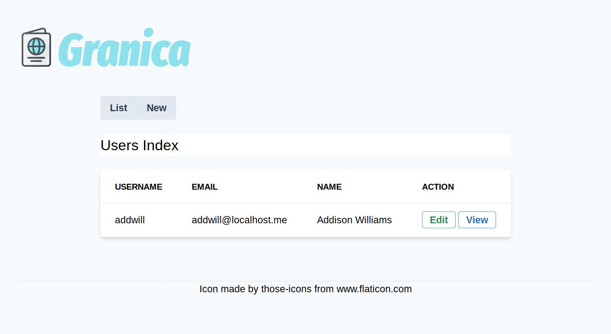

# Granica

Authentication and authorization service.

The final intention of this project is to build a complete authentication and authorization system that can be easily deployed as a microservice.

But at the same time it is also a way to find a modular and systematized foundation to build microservices and micromonoliths; therefore, as a pattern emerges some features, if not alli, will serve to update a series of libraries and a [command-line interface](https://gitlab.com/mikrowezel/backend/cli) that will allow to automate as much as possible the generation of Go-based services while trying not to detach too much from the particular idiosyncrasy of this platform.



[Screenshots](docs/screenshots.md)

## Dev branch

- [new/wip at GitLab](https://gitlab.com/mikrowezel/backend/granica/tree/new/wip)
- [new/wip at GitHub](https://github.com/adrianpk/granica/tree/new/wip)

## Changelog

- [20191221 - User signup confirmation processing](/docs/changelog.md#20191221)
- [20191219 - Mailer](/docs/changelog.md#20191219)
- [20191218 - User signup](/docs/changelog.md#20191218)
- [20191217 - User signin](/docs/changelog.md#20191217)
- [20191216 - Model validation and flash messages](/docs/changelog.md#20191216)
- [20191215 - Form validations](/docs/changelog.md#20191215)
- [20191213 - RESTful actions completed](/docs/changelog.md#20191213)
- [20191128 - Page texts localization](/docs/changelog.md#20191128)
- [20191127 - Simplified error handling](/docs/changelog.md#20191127)
- [20191126 - Simplified flash messages handling](/docs/changelog.md#20191126)
- [20191124 - Embedded translations and form data session store](/docs/changelog.md#20191124)
- [20191123 - Internationalization](/docs/changelog.md#20191123)

## Installation

[TODO: Create database steps]

```shell
$ git clone https://gitlab.com/mikrowezel/backend/granica
$ make run
```

[TODO: additional steps]

**Test**

```shell
$ make test
```

Use `make grc-test` for colored output.

**Run**

```shell
$ make run
./scripts/run.sh
10:22PM INF New handler name=migration-handler
10:22PM INF New handler name=repo-handler
10:22PM INF New handler name=mailer-handler
10:22PM INF Cookie store key value=pVuOO7ZPNBnqTb5o13JsBMOPcPAe4pxY
10:22PM INF Reading template path=layout/base.tmpl
10:22PM INF Reading template path=user/_ctxbar.tmpl
10:22PM INF Reading template path=user/_flash.tmpl
10:22PM INF Reading template path=user/_form.tmpl
10:22PM INF Reading template path=user/_header.tmpl
10:22PM INF Reading template path=user/_item.tmpl
10:22PM INF Reading template path=user/_list.tmpl
10:22PM INF Reading template path=user/_signin.tmpl
10:22PM INF Reading template path=user/_signup.tmpl
10:22PM INF Reading template path=user/edit.tmpl
10:22PM INF Reading template path=user/index.tmpl
10:22PM INF Reading template path=user/initdel.tmpl
10:22PM INF Reading template path=user/new.tmpl
10:22PM INF Reading template path=user/show.tmpl
10:22PM INF Reading template path=user/signin.tmpl
10:22PM INF Reading template path=user/signup.tmpl
10:22PM INF Parsed template set path=user/edit.tmpl
10:22PM INF Parsed template set path=user/signin.tmpl
10:22PM INF Parsed template set path=user/index.tmpl
10:22PM INF Parsed template set path=user/initdel.tmpl
10:22PM INF Parsed template set path=user/new.tmpl
10:22PM INF Parsed template set path=user/show.tmpl
10:22PM INF Parsed template set path=user/signup.tmpl
10:22PM INF Dialing to Postgres host="host=localhost port=5432 user=granica password=granica dbname=granica sslmode=disable"
10:22PM INF Mailer initializated name=mailer-handler
10:22PM INF Postgres connection established
10:22PM INF Repo initializated name=repo-handler
2019/12/19 22:22:00 Migration 'enable_postgis' already applied.
2019/12/19 22:22:00 Migration 'create_users_table' already applied.
2019/12/19 22:22:00 Migration 'create_accounts_table' already applied.
10:22PM INF Migrator initializated name=migration-handler
10:22PM INF JSON REST Server initializing port=:8081
10:22PM INF Web server initializing port=:8080
```

## Deployment

[To be completed]

## Packages

**Worker**

[Auth](pkg/auth/readme.md)

## Helpers

[Supervisord and Gulp](docs/draft/helpers.md)
