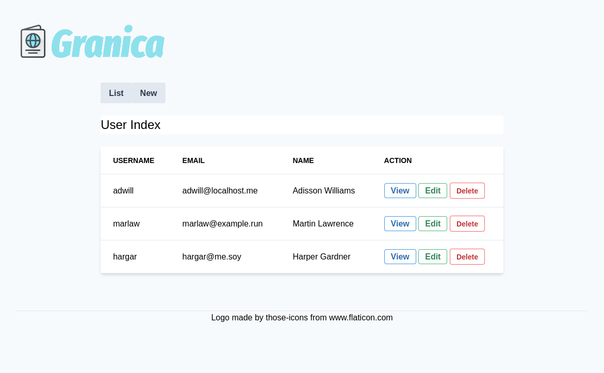

# Granica

 Authentication and authorization service.



## Dev branch

* [new/wip at GitLab](https://gitlab.com/mikrowezel/backend/granica/tree/new/wip)
* [new/wip at GitHub](https://github.com/adrianpk/granica/tree/new/wip)

## Installation

[To be completed]

**Test**
```shell
$ make test
```
Use `make grc-test` for colored output.

**Run**
```shell
$ make run
./scripts/run.sh
7:48PM INF New handler name=migration-handler
7:48PM INF New handler name=repo-handler
7:48PM INF Dialing to Postgres host="host=localhost port=5432 user=######## password=######## dbname=granica sslmode=disable"
7:48PM INF Postgres connection established
7:48PM INF Repo initializated name=repo-handler
2019/11/12 19:48:44 Migration 'enable_postgis' already applied.
2019/11/12 19:48:44 Migration 'create_users_table' already applied.
2019/11/12 19:48:44 Migration 'create_accounts_table' already applied.
7:48PM INF Migrator initializated name=migration-handler
7:48PM INF JSON REST Server initializing port=:8081
7:48PM INF Web server initializing port=:8080
```

## Deployment

[To be completed]

## Packages

**Worker**

[Auth](pkg/auth/readme.md)

## Helpers

[Supervisord and Gulp](docs/draft/helpers.md)
